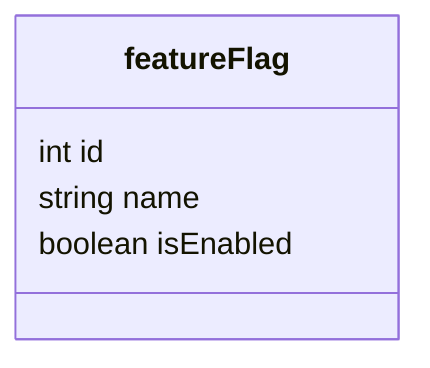

# Introducción
La funcionalidad de *feature flags* para poder activar/desactivar partes del 
programa durante el desarrollo la hacemos con el módulo `FeaturesFlags`.

Este módulo expone una API desde la que se puede hacer el CRUD de la tabla 
de `feature_flag`

Para usar la funcionalidad de feature flag en los controladores y servicios:
- Inyectamos el servicio `FeaturesFlagService` en el constructor.
- Para saber si una feature flag está activa: `await this.
  featuresFlagService.isEnabled('feature-name')`
 